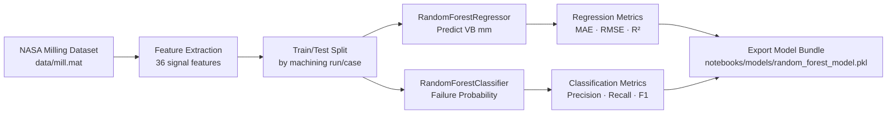
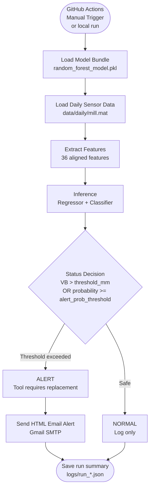
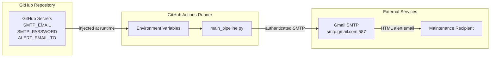

# Predictive Maintenance Pipeline

A machine learning-based predictive maintenance system for CNC milling machines that predicts tool wear (VB - flank wear) and sends an alert when the tool requires replacement.

## Overview

This project monitors 6 sensor channels from the NASA Milling Wear Dataset, extracts statistical features from vibration, acoustic emission, and spindle-related signals, and uses trained Random Forest models to predict flank wear and estimate failure probability. The production script loads the latest run from a daily `.mat` file, performs inference, classifies the machine status as `NORMAL` or `ALERT`, writes execution logs, and sends an HTML email alert when the replacement threshold is exceeded.

## Features

- **Tool Wear Prediction** — Predicts flank wear (VB) in millimeters using a trained Random Forest Regressor
- **Failure Probability Estimation** — Estimates tool failure probability using a Random Forest Classifier
- **Multi-channel Signal Processing** — Processes 6 sensor channels and extracts 6 statistical features per channel
- **Feature Alignment** — Aligns inference features with the feature columns stored in the trained model bundle
- **Binary Alert Logic** — Uses `NORMAL` / `ALERT` status based on wear and probability thresholds
- **HTML Email Alerting** — Sends Gmail SMTP alerts only when status is `ALERT`
- **Manual GitHub Actions Pipeline** — Runs the inference pipeline from GitHub Actions via `workflow_dispatch`
- **Run Logging** — Saves console/file logs and JSON run summaries under `logs/`

## Dataset

This project uses the **NASA Milling Wear Dataset**, a public dataset collected from CNC milling experiments to study tool wear behavior. The dataset contains time-series sensor measurements recorded during milling operations with varying cutting conditions.

📎 **Source**: [NASA Milling Wear Dataset (data.nasa.gov)](https://data.nasa.gov/dataset/milling-wear)

### Dataset Contents

| Component | Description |
|-----------|-------------|
| **Sensor Channels** | 6 channels: Spindle Motor Current, Spindle Motor Drive, Table Vibration, Spindle Vibration, Acoustic Emission (Table), Acoustic Emission (Spindle) |
| **Sampling Length** | Each signal is normalized to 9000 samples for inference |
| **Target Variable** | Flank wear (VB) measured in millimeters |
| **Experimental Runs** | Multiple cases and runs with different cutting conditions and wear progression |
| **File Format** | MATLAB `.mat` file containing a `mill` struct array |

### Usage Notes

- `data/mill.mat` is used as the training dataset in the notebook
- `data/daily/mill.mat` is used by `main_pipeline.py` for daily/manual inference
- The daily loader reads the latest run from the `mill` struct array
- Feature extraction computes 6 statistical descriptors per channel: `std`, `rms`, `peak`, `crest`, `kurt`, and `zero_cross`
- Total inference features: **36 signal features (6 statistics × 6 channels)**. Metadata fields (`DOC`, `Feed`, `Material`) are read from the dataset but are not used as model features.

## Architecture

### 🔧 Model Training (Notebook)



### ⚙️ Daily Inference Pipeline (Production)



### 🔐 Secret Management



## Project Structure

```
predictive-maintenance-pipeline/
├── main_pipeline.py                  # Main inference pipeline orchestrator
├── requirements.txt                  # Python dependencies
├── README.md                         # Project documentation
├── .env                              # Local environment variables (ignored by Git)
├── .gitignore                        # Git ignore rules
├── .github/
│   └── workflows/
│       └── manual_pipeline.yml       # Manual GitHub Actions workflow
├── data/
│   ├── mill.mat                      # MATLAB training dataset
│   └── daily/
│       ├── .gitkeep                  # Keeps daily data directory in Git
│       └── mill.mat                  # Daily/manual inference input
├── notebooks/
│   ├── model_training.ipynb          # Model training and evaluation notebook
│   └── models/
│       └── random_forest_model.pkl   # Trained model bundle
├── src/
│   ├── alert_system.py               # HTML email alert system
│   ├── data_loader.py                # MATLAB .mat daily data loader
│   └── feature_extraction.py         # Signal feature extraction functions
├── reports/
│   └── .gitkeep                      # Reserved output directory
└── logs/                             # Pipeline logs and JSON run summaries
```

## Installation

### Prerequisites

- Python 3.9+ recommended; GitHub Actions uses Python 3.10
- `pip` or `conda`
- Gmail App Password if email alerts are enabled

### Setup

```bash
# Clone or navigate to the project directory
cd predictive-maintenance-pipeline

# Create and activate virtual environment
python -m venv .venv
.venv\Scripts\activate          # Windows
# source .venv/bin/activate     # Linux/Mac

# Install dependencies
pip install -r requirements.txt
```

### Dependencies

| Package | Purpose |
|---------|---------|
| `numpy` | Numerical computations and signal arrays |
| `pandas` | Feature row preparation and column alignment |
| `scipy` | MATLAB `.mat` file loading via `scipy.io` |
| `scikit-learn` | Random Forest models and preprocessing pipeline used by the model bundle |
| `joblib` | Model bundle serialization/deserialization |
| `fpdf2` | PDF/reporting dependency kept in requirements, currently not used by the active pipeline |
| `jupyter` / `ipykernel` | Notebook execution |

> Note: `src/alert_system.py` loads local `.env` files via `python-dotenv`. If your environment does not already include it, install it before running the pipeline or add it to `requirements.txt`.

## Configuration

### Environment Variables

The following environment variables can be set before running the pipeline:

| Variable | Description | Default |
|----------|-------------|---------|
| `MODEL_PATH` | Path to trained model bundle | `notebooks/models/random_forest_model.pkl` |
| `DATA_PATH` | Path to daily sensor `.mat` file | `data/daily/mill.mat` |
| `LOG_DIR` | Output directory for logs and run summaries | `logs` |
| `SMTP_EMAIL` | Sender Gmail address | Required for alerts |
| `SMTP_PASSWORD` | Gmail App Password | Required for alerts |
| `ALERT_EMAIL_TO` | Recipient email address | Required for alerts |

If SMTP variables are not configured, the pipeline still runs inference and writes logs, but alert email delivery is skipped.

### Setting Up Email Alerts

1. Enable 2-Step Verification on your Google Account
2. Generate a [Gmail App Password](https://myaccount.google.com/apppasswords)
3. Set the environment variables locally or configure them as GitHub repository secrets

```powershell
# Windows PowerShell
$env:SMTP_EMAIL = "your-email@gmail.com"
$env:SMTP_PASSWORD = "your-app-password"
$env:ALERT_EMAIL_TO = "recipient@company.com"
```

```bash
# Linux/Mac
export SMTP_EMAIL="your-email@gmail.com"
export SMTP_PASSWORD="your-app-password"
export ALERT_EMAIL_TO="recipient@company.com"
```

You can also place these variables in a local `.env` file for local runs. Do not commit `.env` because it contains secrets.

## Usage

### Training the Model

Run the Jupyter Notebook to train and evaluate the model:

```bash
# Activate virtual environment
.venv\Scripts\activate

# Launch Jupyter
jupyter notebook notebooks/model_training.ipynb
```

Execute all notebook cells sequentially. The trained model bundle should be saved to:

```text
notebooks/models/random_forest_model.pkl
```

The exported bundle is expected to contain at least:

- `regressor`
- `classifier`
- `feature_columns`
- `channel_names`
- `signal_length`
- `threshold_mm`
- `alert_prob_threshold`

### Running the Pipeline

```bash
# Activate virtual environment
.venv\Scripts\activate

# Run the pipeline
python main_pipeline.py
```

The pipeline will:

1. Load the trained model bundle
2. Load the latest run from `data/daily/mill.mat`
3. Extract 36 statistical features from 6 sensor channels
4. Align feature columns with the training-time model bundle
5. Predict tool wear and failure probability
6. Determine machine status: `NORMAL` or `ALERT`
7. Send an HTML email alert if the status is `ALERT`
8. Save a JSON run summary under `logs/`

### Log Output

Logs are written to the console and `logs/pipeline.log`. Run summaries are saved as `logs/run_YYYYMMDD_HHMMSS.json`:

```text
2026-09-05 08:00:00 [INFO] ==================================================
2026-09-05 08:00:00 [INFO] Predictive Maintenance Pipeline - START
2026-09-05 08:00:00 [INFO] Model successfully loaded from notebooks/models/random_forest_model.pkl
2026-09-05 08:00:01 [INFO] Loading sensor data: data/daily/mill.mat
2026-09-05 08:00:01 [INFO] Features ready: 36 columns
2026-09-05 08:00:01 [INFO] Status       : ALERT
2026-09-05 08:00:01 [INFO] Alert HTML email successfully sent.
```

## Model Details

### Sensor Channels (6 input signals)

| Channel | Name | Description |
|---------|------|-------------|
| 0 | `smc` | Spindle Motor Current |
| 1 | `smd` | Spindle Motor Drive |
| 2 | `vib_table` | Table Vibration |
| 3 | `vib_spindle` | Spindle Vibration |
| 4 | `ae_table` | Acoustic Emission (Table) |
| 5 | `ae_spindle` | Acoustic Emission (Spindle) |

### Extracted Features (6 per channel = 36 total)

Each signal channel produces these statistical features:

| Feature | Formula / Meaning | Significance |
|---------|-------------------|--------------|
| `std` | Standard deviation | Signal variability |
| `rms` | Root mean square | Signal energy / power |
| `peak` | Maximum absolute value | Peak stress indicator |
| `crest` | `peak / rms` | Impulse or spike detection |
| `kurt` | Excess kurtosis | Tail heaviness / outlier behavior |
| `zero_cross` | Count of sign changes around the mean | Frequency/content variation indicator |

> Note: the dataset also provides metadata fields (`DOC`, `Feed`, `Material`). These are parsed by `src/data_loader.py` for informational/logging purposes only and are **not** used as model input features.

### Thresholds

Thresholds are stored in the trained model bundle and loaded during inference.

| Parameter | Meaning |
|-----------|---------|
| `threshold_mm` | Tool replacement wear limit in millimeters |
| `alert_prob_threshold` | Failure probability level that triggers an alert |

### Status Logic (Binary)

| Status | Condition | Action |
|--------|-----------|--------|
| **NORMAL** | `predicted_vb_mm <= threshold_mm` AND `failure_probability < alert_prob_threshold` | Continue operation, log result only |
| **ALERT** | `predicted_vb_mm > threshold_mm` OR `failure_probability >= alert_prob_threshold` | Recommend stopping machine and replacing the tool; send HTML email alert if SMTP is configured |

## Workflow

### Training Pipeline (`model_training.ipynb`)

```text
Cell 1: Import & Config          → Libraries, constants, data/model paths
Cell 2: Helper Functions         → Scalar/signal conversion and feature cleaning
Cell 3: Feature Extraction       → Compute statistical features for 6 channels
Cell 4: Load Dataset             → Parse MATLAB .mat data and build feature table
Cell 5: Data Split               → Split training/evaluation data and align columns
Cell 6: Train Regressor          → Train RandomForestRegressor for VB prediction
Cell 7: Regression Evaluation    → Evaluate MAE, RMSE, and R²
Cell 8: Threshold Evaluation     → Evaluate binary alert behavior at wear threshold
Cell 9: Train Classifier         → Train RandomForestClassifier for failure probability
Cell 10: Export Model            → Save trained bundle to notebooks/models/*.pkl
```

### Inference Pipeline (`main_pipeline.py`)

```text
Step 1: Load Model               → Validate required model bundle keys
Step 2: Load Daily Data          → Read latest run from data/daily/mill.mat
Step 3: Extract Features         → Build 36-feature inference row
Step 4: Prepare Features         → Match model feature order and clean invalid values
Step 5: Predict                  → Regressor predicts VB; classifier predicts probability
Step 6: Status Decision          → NORMAL / ALERT binary decision
Step 7: Send Alert               → Send HTML email only when status is ALERT
Step 8: Save Summary             → Write logs/run_YYYYMMDD_HHMMSS.json
```

### GitHub Actions (`manual_pipeline.yml`)

The workflow is configured for manual execution from the GitHub Actions tab:

```yaml
on:
  workflow_dispatch:
```

Before running it in GitHub, configure these repository secrets:

- `SMTP_EMAIL`
- `SMTP_PASSWORD`
- `ALERT_EMAIL_TO`

## Troubleshooting

| Issue | Solution |
|-------|----------|
| `Sensor data file not found` | Ensure `data/daily/mill.mat` exists or set `DATA_PATH` to a valid `.mat` file |
| `Field 'mill' not found` | Use a MATLAB file with the expected NASA Milling `mill` struct array |
| `Model not found` | Run `notebooks/model_training.ipynb` first or set `MODEL_PATH` to an existing model bundle |
| `Model bundle is incomplete` | Re-export the model so it includes `regressor`, `classifier`, `feature_columns`, `channel_names`, `signal_length`, `threshold_mm`, and `alert_prob_threshold` |
| `Invalid/empty signal` | Check that all 6 sensor signals exist and contain finite numeric values |
| `Email credentials not set` | Configure `SMTP_EMAIL`, `SMTP_PASSWORD`, and `ALERT_EMAIL_TO`; use a Gmail App Password |
| `Failed to send email` | Verify Gmail SMTP access, App Password, recipient address, and network connectivity |
| `ModuleNotFoundError: dotenv` | Install `python-dotenv` or add it to `requirements.txt` |

## License

This project is for educational and research purposes.
