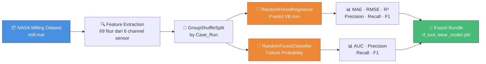
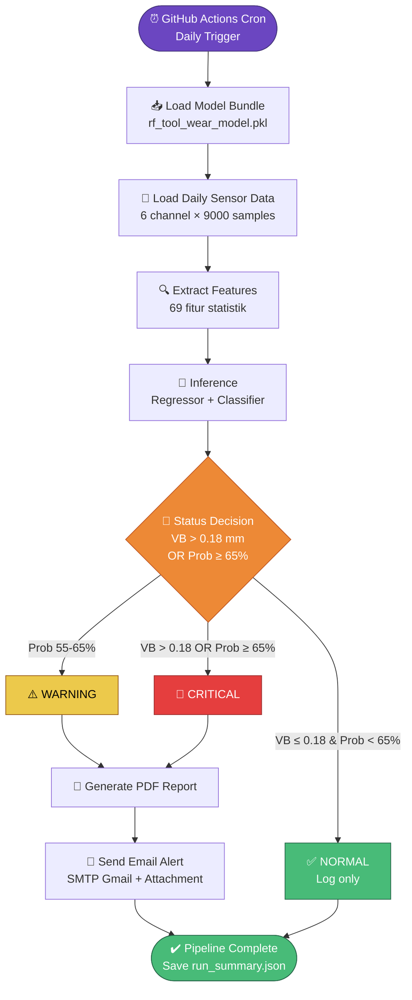
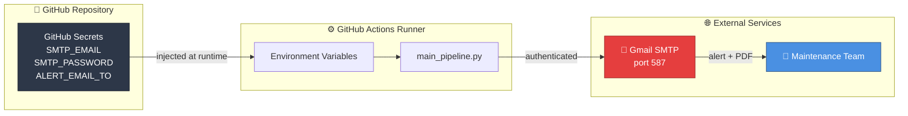

# Predictive Maintenance Pipeline

A machine learning-based predictive maintenance system for CNC milling machines that predicts tool wear (VB - flank wear) in real-time and triggers automated alerts when critical thresholds are exceeded.

## Overview

This pipeline monitors 6 sensor channels from a milling machine, extracts statistical features from vibration, acoustic emission, and spindle current signals, and uses trained Random Forest models to predict tool wear and assess failure probability. When predictions exceed safety thresholds, the system automatically generates a PDF report and sends an email alert.

## Features

- **Real-time Tool Wear Prediction** — Predicts flank wear (VB) in millimeters using a Random Forest Regressor
- **Failure Probability Estimation** — Classifies damage risk using a Random Forest Classifier
- **Multi-channel Signal Processing** — Extracts 11 statistical features per channel (mean, std, rms, crest factor, kurtosis, etc.)
- **Automated Alerting** — Sends email notifications with PDF reports when wear exceeds 0.18 mm or failure probability exceeds 65%
- **Daily Inference Pipeline** — Scheduled batch processing of daily sensor data
- **Model Versioning** — Trained models exported with full metrics and metadata

## Architecture

### 🔧 Model Training (Notebook)



### ⚙️ Daily Inference Pipeline (Production)



### 🔐 Secret Management



## Project Structure

```
predictive-maintenance-pipeline/
├── main_pipeline.py          # Main inference pipeline orchestrator
├── requirements.txt          # Python dependencies
├── README.md                 # This file
├── data/
│   ├── mill.mat              # MATLAB training dataset (6 sensor channels)
│   └── daily/                # Directory for daily sensor data files
├── notebooks/
│   └── model_training.ipynb  # Model training & evaluation notebook
├── models/
│   └── random_forest_model.pkl  # Trained model bundle (exported)
├── src/
│   ├── feature_extraction.py  # Signal feature extraction functions
│   ├── pdf_generator.py       # PDF report generation
│   └── alert_system.py        # Email alert system
└── reports/
    └── *.pdf                   # Generated alert reports
```

## Installation

### Prerequisites

- Python 3.9+
- pip or conda

### Setup

```bash
# Clone or navigate to the project directory
cd predictive-maintenance-pipeline

# Create and activate virtual environment
python -m venv .venv
.venv\Scripts\activate          # Windows
# source .venv/bin/activate     # Linux/Mac

# Install dependencies
pip install -r requirements.txt
```

### Dependencies

| Package | Purpose |
|---------|---------|
| `numpy` | Numerical computations |
| `pandas` | Data manipulation |
| `scipy` | MATLAB file I/O (`scipy.io`) |
| `scikit-learn` | Random Forest models, metrics |
| `joblib` | Model serialization |
| `fpdf` | PDF report generation |
| `jupyter` / `ipykernel` | Notebook execution |

## Configuration

### Environment Variables

The following environment variables must be set before running the pipeline:

| Variable | Description | Example |
|----------|-------------|---------|
| `MODEL_PATH` | Path to trained model file | `notebooks/models/rf_tool_wear_model.pkl` |
| `DATA_PATH` | Path to daily sensor data | `data/daily/mill.mat` |
| `REPORT_DIR` | Output directory for PDF reports | `reports` |
| `LOG_DIR` | Output directory for logs | `logs` |
| `SMTP_EMAIL` | Sender Gmail address | `your-email@gmail.com` |
| `SMTP_PASSWORD` | Gmail App Password | `abcd efgh ijkl mnop` |
| `ALERT_EMAIL_TO` | Recipient email address | `manager@company.com` |
| `ALERT_SUBJECT_PREFIX` | Email subject prefix | `[CRITICAL] Tool Wear Alert` |

### Setting Up Email Alerts

1. Enable 2-Step Verification on your Google Account
2. Generate an [App Password](https://myaccount.google.com/apppasswords)
3. Set the environment variables:

```powershell
# Windows PowerShell
$env:SMTP_EMAIL = "your-email@gmail.com"
$env:SMTP_PASSWORD = "your-app-password"
$env:ALERT_EMAIL_TO = "recipient@company.com"
```

```bash
# Linux/Mac
export SMTP_EMAIL="your-email@gmail.com"
export SMTP_PASSWORD="your-app-password"
export ALERT_EMAIL_TO="recipient@company.com"
```

## Usage

### Training the Model

Run the Jupyter Notebook to train and evaluate the model:

```bash
# Activate virtual environment
.venv\Scripts\activate

# Launch Jupyter
jupyter notebook notebooks/model_training.ipynb
```

Execute all cells sequentially. The trained model will be saved to `models/random_forest_model.pkl`.

### Running the Pipeline

```bash
# Activate virtual environment
.venv\Scripts\activate

# Run the pipeline
python main_pipeline.py
```

The pipeline will:
1. Load the trained model
2. Process daily sensor data
3. Predict tool wear and failure probability
4. Determine machine status (NORMAL / WARNING / CRITICAL)
5. Generate a PDF report if any alert is triggered
6. Send an email alert for CRITICAL status

### Log Output

Logs are written to both console and `logs/pipeline.log`:

```
2026-09-05 08:00:00 [INFO] ==================================================
2026-09-05 08:00:00 [INFO] Predictive Maintenance Pipeline - START
2026-09-05 08:00:00 [INFO] Model successfully loaded from notebooks/models/rf_tool_wear_model.pkl
2026-09-05 08:00:01 [INFO] Machine Status: CRITICAL
2026-09-05 08:00:01 [INFO] Alert email successfully sent to manager@company.com
```

## Model Details

### Sensor Channels (6 input signals)

| Channel | Name | Description |
|---------|------|-------------|
| 0 | `smc` | Spindle Motor Current |
| 1 | `smd` | Spindle Motor Drive |
| 2 | `vib_table` | Table Vibration |
| 3 | `vib_spindle` | Spindle Vibration |
| 4 | `ae_table` | Acoustic Emission (Table) |
| 5 | `ae_spindle` | Acoustic Emission (Spindle) |

### Extracted Features (11 per channel = 66 total)

Each signal channel produces these statistical features:

| Feature | Formula | Significance |
|---------|---------|--------------|
| `mean` | Average amplitude | Baseline signal level |
| `std` | Standard deviation | Signal variability |
| `rms` | Root mean square | Power of the signal |
| `abs_mean` | Mean absolute value | Average magnitude |
| `peak` | Maximum absolute value | Peak stress indicator |
| `p2p` | Peak-to-peak | Total signal swing |
| `crest` | peak / RMS | Impulse detection |
| `energy` | Mean of squared values | Signal energy |
| `skew` | Third standardized moment | Asymmetry of distribution |
| `kurt` | Excess kurtosis | Tail heaviness / outliers |
| `zero_cross` | Zero-crossing rate | Frequency content |

### Thresholds

| Parameter | Value | Meaning |
|-----------|-------|---------|
| `threshold_mm` | 0.18 mm | Critical flank wear limit |
| `alert_prob_threshold` | 65% | Failure probability alert level |

### Status Logic

| Status | Condition | Action |
|--------|-----------|--------|
| **NORMAL** | Wear below threshold AND low failure probability | No action |
| **WARNING** | Failure probability within 10% of alert threshold | Monitor closely |
| **CRITICAL** | Wear > 0.18 mm OR failure probability ≥ 65% | Stop machine, replace tool, send alert |

## Workflow

### Training Pipeline (`model_training.ipynb`)

```
Cell 1: Import & Config          → Libraries, constants, data paths
Cell 2: Helper Functions          → to_scalar, to_signal, safe_float, clean_features
Cell 3: Feature Extraction        → compute_channel_features, extract_features_from_signals
Cell 4: Load Dataset              → Parse MATLAB .mat, extract features from all runs
Cell 5: Data Split                → GroupShuffleSplit (80/20), column alignment
Cell 6: Train Regressor           → RandomForestRegressor (n=700, depth=14)
Cell 7: Regression Evaluation     → MAE, RMSE, R²
Cell 8: Crisis Threshold Eval     → Precision, Recall, F1 at 0.18 mm
Cell 9: Train Classifier          → RandomForestClassifier for failure probability
Cell 10: Export Model             → Save bundle with metrics to .pkl
```

### Inference Pipeline (`main_pipeline.py`)

```
Step 1: Load Model               → Validate bundle completeness
Step 2: Load Daily Data          → Read sensor signals from .mat file
Step 3: Extract Features         → 66 features from 6 channels
Step 4: Predict                  → Regressor → VB (mm), Classifier → probability
Step 5: Status Decision          → NORMAL / WARNING / CRITICAL
Step 6: Generate Report          → PDF with prediction details
Step 7: Send Alert               → Email with PDF attachment (if CRITICAL)
```

## Troubleshooting

| Issue | Solution |
|-------|----------|
| `FileNotFoundError: mill.mat not found` | Ensure `data/mill.mat` exists or set `DATA_PATH` env var |
| `Model not found` | Run `model_training.ipynb` first to generate the model file |
| `Email sending failed` | Verify SMTP credentials; use App Password, not regular password |
| `No valid samples extracted` | Check MATLAB file format; ensure correct field names |
| `Infinity in features` | Signals contain non-finite values; check raw sensor data |

## License

This project is for educational and research purposes.
